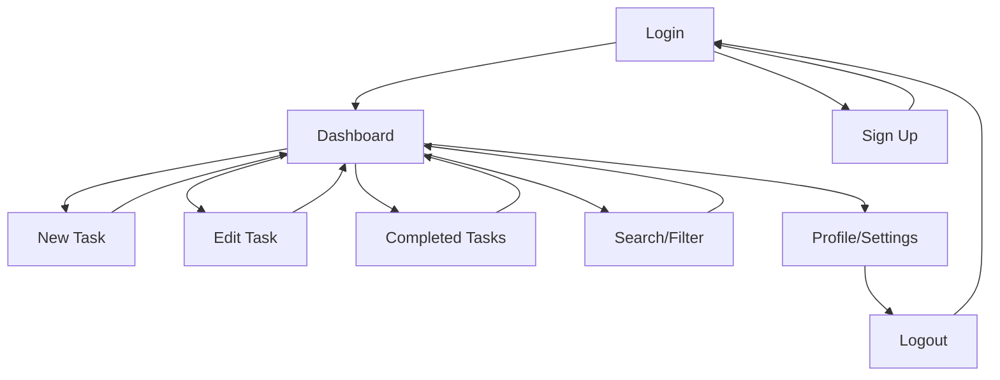

# User Interface Wireframes
**Personal Task Management Application**

This document contains wireframes and mockups for all application screens, designed to meet the usability and compatibility requirements from Assignment 1.

## Design Principles

### Usability Goals
- **Intuitive Navigation**: Clear, consistent navigation patterns
- **Minimal Learning Curve**: Self-explanatory interface elements
- **Efficient Task Management**: Quick access to common actions
- **Visual Hierarchy**: Important elements stand out clearly

### Responsive Design Strategy
- **Mobile-First Approach**: Designed for mobile, enhanced for desktop
- **Breakpoints**: 
  - Mobile: 320px - 768px
  - Tablet: 768px - 1024px  
  - Desktop: 1024px+
- **Touch-Friendly**: Minimum 44px touch targets on mobile

## Screen Wireframes

### 1. Authentication Screens

#### 1.1 Login Screen

```
┌─────────────────────────────────────────┐
│                                         │
│          [LOGO] Task Manager            │
│                                         │
│  ┌─────────────────────────────────┐    │
│  │            LOGIN                │    │
│  │                                 │    │
│  │  Email Address                  │    │
│  │  ┌─────────────────────────────┐ │    │
│  │  │ user@example.com            │ │    │
│  │  └─────────────────────────────┘ │    │
│  │                                 │    │
│  │  Password                       │    │
│  │  ┌─────────────────────────────┐ │    │
│  │  │ ••••••••••••••••            │ │    │
│  │  └─────────────────────────────┘ │    │
│  │                                 │    │
│  │  [ Remember Me ] [Forgot Pass?] │    │
│  │                                 │    │
│  │  ┌─────────────────────────────┐ │    │
│  │  │         LOG IN              │ │    │
│  │  └─────────────────────────────┘ │    │
│  │                                 │    │
│  │  Don't have an account?         │    │
│  │  [Sign Up Here]                 │    │
│  └─────────────────────────────────┘    │
│                                         │
└─────────────────────────────────────────┘
```

**Features:**
- Clean, centered login form
- Clear call-to-action button
- Link to registration
- Password visibility toggle (mobile)
- Form validation feedback

#### 1.2 Sign Up Screen

```
┌─────────────────────────────────────────┐
│                                         │
│          [LOGO] Task Manager            │
│                                         │
│  ┌─────────────────────────────────┐    │
│  │           SIGN UP               │    │
│  │                                 │    │
│  │  Email Address                  │    │
│  │  ┌─────────────────────────────┐ │    │
│  │  │ user@example.com            │ │    │
│  │  └─────────────────────────────┘ │    │
│  │                                 │    │
│  │  Password                       │    │
│  │  ┌─────────────────────────────┐ │    │
│  │  │ ••••••••••••••••            │ │    │
│  │  └─────────────────────────────┘ │    │
│  │                                 │    │
│  │  Confirm Password               │    │
│  │  ┌─────────────────────────────┐ │    │
│  │  │ ••••••••••••••••            │ │    │
│  │  └─────────────────────────────┘ │    │
│  │                                 │    │
│  │  ┌─────────────────────────────┐ │    │
│  │  │        CREATE ACCOUNT       │ │    │
│  │  └─────────────────────────────┘ │    │
│  │                                 │    │
│  │  Already have an account?       │    │
│  │  [Log In Here]                  │    │
│  └─────────────────────────────────┘    │
│                                         │
└─────────────────────────────────────────┘
```

### 2. Main Application Screens

#### 2.1 Dashboard / Task List View

```
┌─────────────────────────────────────────────────────────────┐
│ [☰] Task Manager                           [Profile] [⚙️]   │
├─────────────────────────────────────────────────────────────┤
│                                                             │
│ ┌─────────────────────────────────────────────────────────┐ │
│ │  [+ New Task]              [🔍 Search]   [Filter ▼]     │ │
│ └─────────────────────────────────────────────────────────┘ │
│                                                             │
│ ┌─────────────────────────────────────────────────────────┐ │
│ │ Active Tasks (5)                        [View All]      │ │
│ ├─────────────────────────────────────────────────────────┤ │
│ │                                                         │ │
│ │ ┌─────────────────────────────────────────────────────┐ │ │
│ │ │ ☐ Finish project proposal                           │ │ │
│ │ │   Due: Dec 15, 2024  Priority: High                │ │ │
│ │ │   [Edit] [Complete] [Delete]                       │ │ │
│ │ └─────────────────────────────────────────────────────┘ │ │
│ │                                                         │ │
│ │ ┌─────────────────────────────────────────────────────┐ │ │
│ │ │ ☐ Review design documents                           │ │ │
│ │ │   Due: Dec 12, 2024  Priority: Medium              │ │ │
│ │ │   [Edit] [Complete] [Delete]                       │ │ │
│ │ └─────────────────────────────────────────────────────┘ │ │
│ │                                                         │ │
│ │ ┌─────────────────────────────────────────────────────┐ │ │
│ │ │ ☐ Update documentation                              │ │ │
│ │ │   Due: Dec 10, 2024  Priority: Low                 │ │ │
│ │ │   [Edit] [Complete] [Delete]                       │ │ │
│ │ └─────────────────────────────────────────────────────┘ │ │
│ └─────────────────────────────────────────────────────────┘ │
│                                                             │
│ ┌─────────────────────────────────────────────────────────┐ │
│ │ Quick Actions                                           │ │
│ │ [View Completed (12)] [Statistics] [Export]             │ │
│ └─────────────────────────────────────────────────────────┘ │
│                                                             │
└─────────────────────────────────────────────────────────────┘
```

**Features:**
- Responsive header with hamburger menu (mobile)
- Prominent "New Task" button
- Search and filter capabilities
- Task cards with priority indicators
- Quick action buttons on each task
- Summary statistics

#### 2.2 Create/Edit Task Form

```
┌─────────────────────────────────────────────────────────────┐
│ [←] New Task                                    [Save] [✕]  │
├─────────────────────────────────────────────────────────────┤
│                                                             │
│ ┌─────────────────────────────────────────────────────────┐ │
│ │ Task Title *                                            │ │
│ │ ┌─────────────────────────────────────────────────────┐ │ │
│ │ │ Enter task title...                                 │ │ │
│ │ └─────────────────────────────────────────────────────┘ │ │
│ │                                                         │ │
│ │ Description                                             │ │
│ │ ┌─────────────────────────────────────────────────────┐ │ │
│ │ │                                                     │ │ │
│ │ │ Add more details about this task...                 │ │ │
│ │ │                                                     │ │ │
│ │ │                                                     │ │ │
│ │ └─────────────────────────────────────────────────────┘ │ │
│ │                                                         │ │
│ │ Due Date                                                │ │
│ │ ┌─────────────────────────────────────────────────────┐ │ │
│ │ │ [📅] 12/15/2024                                     │ │ │
│ │ └─────────────────────────────────────────────────────┘ │ │
│ │                                                         │ │
│ │ Priority Level                                          │ │
│ │ ┌─────────────────────────────────────────────────────┐ │ │
│ │ │ ( ) Low  (●) Medium  ( ) High                       │ │ │
│ │ └─────────────────────────────────────────────────────┘ │ │
│ │                                                         │ │
│ │ ┌─────────────────────────────────────────────────────┐ │ │
│ │ │                   SAVE TASK                         │ │ │
│ │ └─────────────────────────────────────────────────────┘ │ │
│ │                                                         │ │
│ │ [Cancel]                                                │ │
│ └─────────────────────────────────────────────────────────┘ │
│                                                             │
└─────────────────────────────────────────────────────────────┘
```

**Features:**
- Clear form layout with required field indicators
- Text area for description
- Date picker for due dates
- Radio buttons for priority selection
- Prominent save button
- Cancel option

#### 2.3 Completed Tasks View

```
┌─────────────────────────────────────────────────────────────┐
│ [←] Completed Tasks                         [Filter ▼]      │
├─────────────────────────────────────────────────────────────┤
│                                                             │
│ ┌─────────────────────────────────────────────────────────┐ │
│ │ Completed Tasks (12)                    [Clear All]     │ │
│ ├─────────────────────────────────────────────────────────┤ │
│ │                                                         │ │
│ │ ┌─────────────────────────────────────────────────────┐ │ │
│ │ │ ✅ Design wireframes                               │ │ │
│ │ │    Completed: Dec 8, 2024                          │ │ │
│ │ │    [Restore] [Delete]                              │ │ │
│ │ └─────────────────────────────────────────────────────┘ │ │
│ │                                                         │ │
│ │ ┌─────────────────────────────────────────────────────┐ │ │
│ │ │ ✅ Set up development environment                   │ │ │
│ │ │    Completed: Dec 7, 2024                          │ │ │
│ │ │    [Restore] [Delete]                              │ │ │
│ │ └─────────────────────────────────────────────────────┘ │ │
│ │                                                         │ │
│ │ ┌─────────────────────────────────────────────────────┐ │ │
│ │ │ ✅ Research task management tools                   │ │ │
│ │ │    Completed: Dec 5, 2024                          │ │ │
│ │ │    [Restore] [Delete]                              │ │ │
│ │ └─────────────────────────────────────────────────────┘ │ │
│ │                                                         │ │
│ │ [Load More...]                                          │ │
│ └─────────────────────────────────────────────────────────┘ │
│                                                             │
└─────────────────────────────────────────────────────────────┘
```

**Features:**
- Clear visual distinction (checkmark icons)
- Completion dates
- Restore/delete options
- Pagination for performance

### 3. Mobile Responsive Layouts

#### 3.1 Mobile Task List (320px - 768px)

```
┌─────────────────────────┐
│ [☰] Tasks      [+] [👤] │
├─────────────────────────┤
│                         │
│ ┌─────────────────────┐ │
│ │ [🔍] Search...      │ │
│ └─────────────────────┘ │
│                         │
│ [Filter: All ▼] [Sort ▼]│
│                         │
│ ┌─────────────────────┐ │
│ │ ☐ Finish proposal   │ │
│ │   📅 Dec 15 🔴 High │ │
│ │   [✓] [✏️] [🗑️]     │ │
│ └─────────────────────┘ │
│                         │
│ ┌─────────────────────┐ │
│ │ ☐ Review docs       │ │
│ │   📅 Dec 12 🟡 Med  │ │
│ │   [✓] [✏️] [🗑️]     │ │
│ └─────────────────────┘ │
│                         │
│ ┌─────────────────────┐ │
│ │ ☐ Update docs       │ │
│ │   📅 Dec 10 🟢 Low  │ │
│ │   [✓] [✏️] [🗑️]     │ │
│ └─────────────────────┘ │
│                         │
│ ┌─────────────────────┐ │
│ │    + NEW TASK       │ │
│ └─────────────────────┘ │
│                         │
└─────────────────────────┘
```

#### 3.2 Mobile Task Form

```
┌─────────────────────────┐
│ [←] New Task      [Save]│
├─────────────────────────┤
│                         │
│ Title *                 │
│ ┌─────────────────────┐ │
│ │ Task title...       │ │
│ └─────────────────────┘ │
│                         │
│ Description             │
│ ┌─────────────────────┐ │
│ │                     │ │
│ │ Details...          │ │
│ │                     │ │
│ └─────────────────────┘ │
│                         │
│ Due Date                │
│ ┌─────────────────────┐ │
│ │ [📅] Dec 15, 2024   │ │
│ └─────────────────────┘ │
│                         │
│ Priority                │
│ ┌─────────────────────┐ │
│ │ Low  Med  High      │ │
│ │ ( )  (●)  ( )       │ │
│ └─────────────────────┘ │
│                         │
│ ┌─────────────────────┐ │
│ │     SAVE TASK       │ │
│ └─────────────────────┘ │
│                         │
│ [Cancel]                │
│                         │
└─────────────────────────┘
```

## Navigation Flow



## Design System

### Color Palette
- **Primary**: #2563EB (Blue)
- **Secondary**: #64748B (Slate)
- **Success**: #10B981 (Green)
- **Warning**: #F59E0B (Amber)
- **Error**: #EF4444 (Red)
- **Background**: #F8FAFC (Light Gray)
- **Text**: #1E293B (Dark Slate)

### Typography
- **Headers**: Inter, Bold, 24px-32px
- **Body**: Inter, Regular, 16px
- **Small Text**: Inter, Regular, 14px
- **Buttons**: Inter, Medium, 16px

### Component Standards
- **Buttons**: 44px minimum height, rounded corners
- **Input Fields**: 48px height, clear labels
- **Cards**: Shadow, rounded corners, 16px padding
- **Icons**: 24px size, consistent style

### Accessibility Features
- **High Contrast**: WCAG AA compliant color ratios
- **Keyboard Navigation**: Full keyboard accessibility
- **Screen Reader**: Proper ARIA labels and semantic HTML
- **Touch Targets**: 44px minimum for touch interfaces

## Usability Testing Checklist

- [ ] Can users complete task creation within 30 seconds?
- [ ] Is navigation intuitive without instructions?
- [ ] Are all interactive elements easily discoverable?
- [ ] Does the interface work on all target devices?
- [ ] Are error messages clear and helpful?
- [ ] Can users find completed tasks easily?
- [ ] Is the sorting/filtering functionality intuitive?

## Implementation Notes

### Frontend Framework Integration
- **React Components**: Each screen maps to main components
- **State Management**: Redux/Context for global state
- **Routing**: React Router for navigation
- **Responsive**: CSS Grid/Flexbox with breakpoints

### Progressive Enhancement
- **Core Functionality**: Works without JavaScript
- **Enhanced Experience**: Rich interactions with JS
- **Offline Support**: Service worker for basic functionality
- **Performance**: Lazy loading, code splitting

This wireframe design ensures the Personal Task Management Application meets all usability and compatibility requirements while providing an intuitive, efficient user experience across all devices.