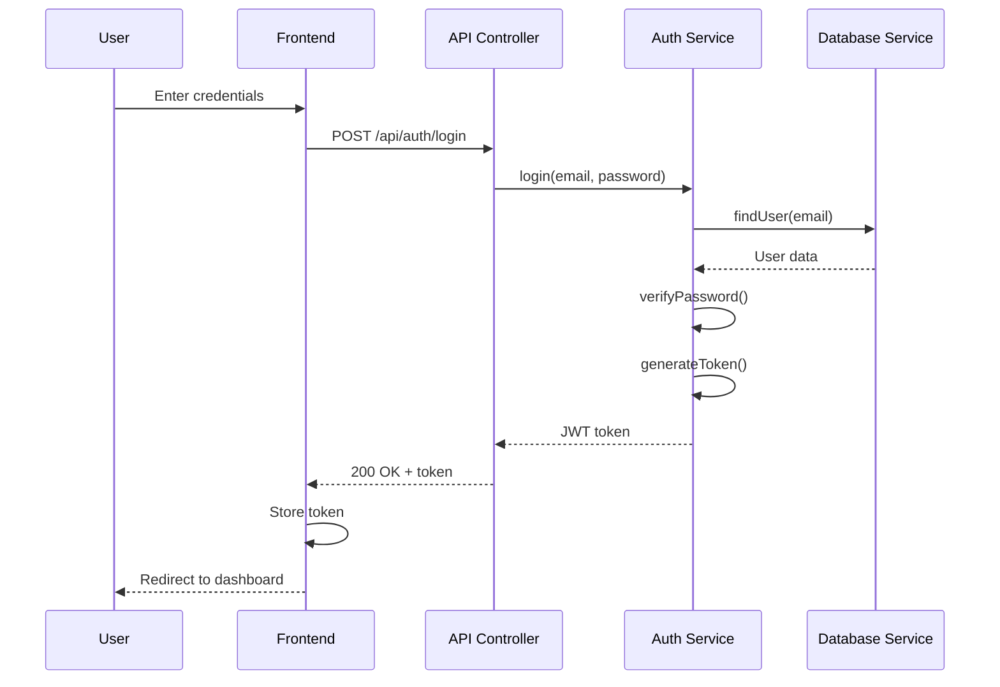
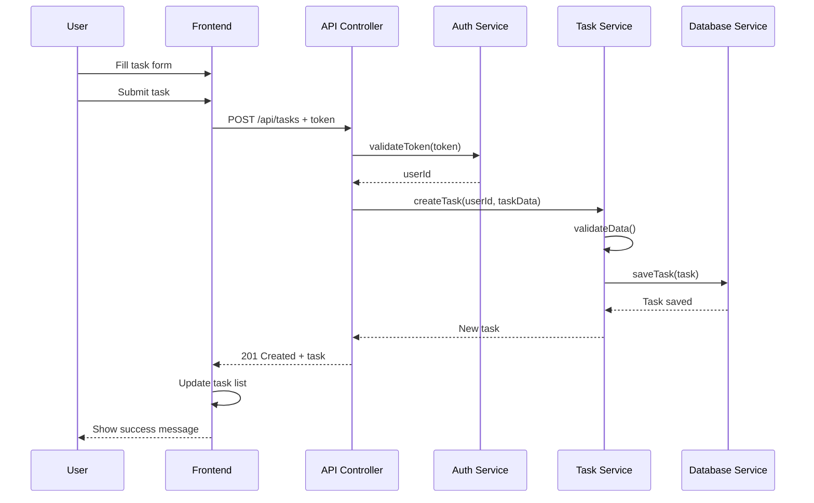
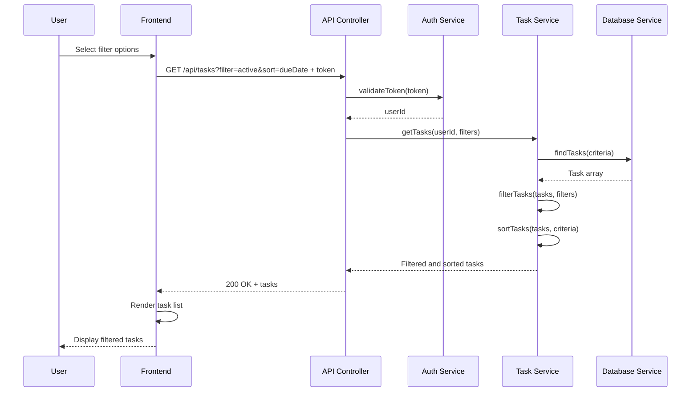
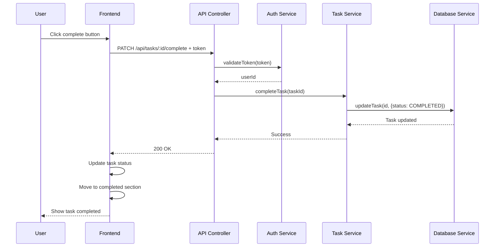

# UML Diagrams
**Personal Task Management Application**

This document contains all UML diagrams for the Personal Task Management Application, including use case, class, and sequence diagrams that illustrate the system structure and behavior.

## 1. Use Case Diagram

The use case diagram shows the interactions between the user and the task management system.

```mermaid
graph TB
    User((User))
    
    subgraph "Task Management System"
        UC1[Sign Up]
        UC2[Log In]
        UC3[Log Out]
        UC4[Create Task]
        UC5[View Tasks]
        UC6[Edit Task]
        UC7[Complete Task]
        UC8[Delete Task]
        UC9[Filter Tasks]
        UC10[Sort Tasks]
        UC11[View Completed Tasks]
    end
    
    User --> UC1
    User --> UC2
    User --> UC3
    User --> UC4
    User --> UC5
    User --> UC6
    User --> UC7
    User --> UC8
    User --> UC9
    User --> UC10
    User --> UC11
    
    UC4 -.-> UC2 : "requires"
    UC5 -.-> UC2 : "requires"
    UC6 -.-> UC2 : "requires"
    UC7 -.-> UC2 : "requires"
    UC8 -.-> UC2 : "requires"
    UC9 -.-> UC2 : "requires"
    UC10 -.-> UC2 : "requires"
    UC11 -.-> UC2 : "requires"
```

### Use Case Descriptions

| Use Case | Description | Preconditions | Postconditions |
|----------|-------------|---------------|----------------|
| Sign Up | User creates a new account | User not registered | User account created |
| Log In | User authenticates with credentials | User has valid account | User authenticated and session created |
| Log Out | User ends current session | User is logged in | Session terminated |
| Create Task | User adds a new task | User is logged in | New task added to user's task list |
| View Tasks | User sees list of active tasks | User is logged in | Active tasks displayed |
| Edit Task | User modifies existing task details | User is logged in, task exists | Task details updated |
| Complete Task | User marks task as completed | User is logged in, task exists and is active | Task marked as completed |
| Delete Task | User removes task from system | User is logged in, task exists | Task removed from system |
| Filter Tasks | User filters tasks by criteria | User is logged in, tasks exist | Filtered task list displayed |
| Sort Tasks | User sorts tasks by date/priority | User is logged in, tasks exist | Sorted task list displayed |
| View Completed Tasks | User sees completed tasks | User is logged in | Completed tasks displayed |

## 2. Class Diagram

The class diagram shows the main entities and their relationships in the system.

```mermaid
classDiagram
    class User {
        -id: String
        -email: String
        -passwordHash: String
        -createdAt: Date
        -updatedAt: Date
        +signUp(email, password): Boolean
        +login(email, password): String
        +logout(): Boolean
        +updateProfile(data): Boolean
    }
    
    class Task {
        -id: String
        -userId: String
        -title: String
        -description: String
        -dueDate: Date
        -priority: Priority
        -status: TaskStatus
        -createdAt: Date
        -updatedAt: Date
        +create(taskData): Task
        +update(taskData): Boolean
        +markComplete(): Boolean
        +delete(): Boolean
        +validateData(): Boolean
    }
    
    class TaskService {
        +createTask(userId, taskData): Task
        +getTasks(userId, filters): Task[]
        +updateTask(taskId, taskData): Boolean
        +deleteTask(taskId): Boolean
        +completeTask(taskId): Boolean
        +getCompletedTasks(userId): Task[]
        +sortTasks(tasks, criteria): Task[]
        +filterTasks(tasks, filters): Task[]
    }
    
    class AuthService {
        +signup(email, password): User
        +login(email, password): String
        +logout(token): Boolean
        +validateToken(token): Boolean
        +refreshToken(token): String
        +hashPassword(password): String
        +verifyPassword(password, hash): Boolean
    }
    
    class DatabaseService {
        +connect(): Boolean
        +disconnect(): Boolean
        +findUser(criteria): User
        +saveUser(user): Boolean
        +findTasks(criteria): Task[]
        +saveTask(task): Boolean
        +updateTask(id, data): Boolean
        +deleteTask(id): Boolean
    }
    
    class APIController {
        +handleAuth(request, response): void
        +handleTasks(request, response): void
        +validateRequest(request): Boolean
        +sendResponse(response, data): void
        +handleError(error, response): void
    }
    
    class Priority {
        <<enumeration>>
        LOW
        MEDIUM
        HIGH
    }
    
    class TaskStatus {
        <<enumeration>>
        ACTIVE
        COMPLETED
        DELETED
    }
    
    User ||--o{ Task : "owns"
    Task ||--|| Priority : "has"
    Task ||--|| TaskStatus : "has"
    
    TaskService ..> Task : "manages"
    TaskService ..> DatabaseService : "uses"
    AuthService ..> User : "manages"
    AuthService ..> DatabaseService : "uses"
    
    APIController ..> TaskService : "uses"
    APIController ..> AuthService : "uses"
```

### Class Descriptions

**User**: Represents a user account with authentication credentials and profile information.

**Task**: Represents a task item with all necessary details for task management.

**TaskService**: Business logic service for all task-related operations.

**AuthService**: Business logic service for authentication and user management.

**DatabaseService**: Data access layer for database operations.

**APIController**: Presentation layer controller for handling HTTP requests and responses.

**Priority & TaskStatus**: Enumerations for task attributes.

## 3. Sequence Diagrams

### 3.1 User Login Sequence



### 3.2 Create Task Sequence



### 3.3 View Tasks with Filtering Sequence



### 3.4 Complete Task Sequence



## Summary

These UML diagrams provide a comprehensive view of the Personal Task Management Application:

- **Use Case Diagram**: Shows all user interactions with the system
- **Class Diagram**: Defines the system structure with entities and relationships
- **Sequence Diagrams**: Illustrate the flow of key operations

The diagrams align with the functional requirements from Assignment 1 and support the layered architecture design, providing clear guidance for the implementation phase.